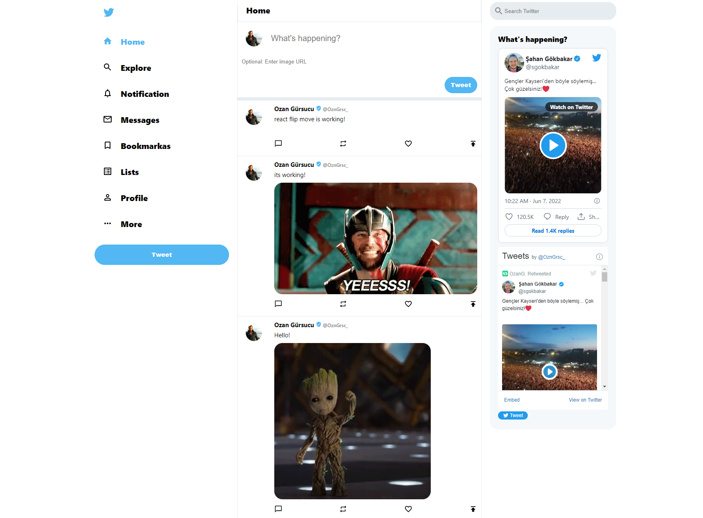

# Twitter-Clone 

Click demo to try it by yourself!

You can send your comments about the project as tweet to me!

## Twitter-Clone Demo Link

You can view the site here
[Click Me](https://twitter-clone-ozngrsc.web.app/)

## Topics

- ReactJS
- JavaScript
- React Flip Move
- Firebase - Cloud Firestore Database
- React Twitter Embed
- React Hooks Functional(Hooks, State)
- React Router
- React Icons
- Material UI
- Responsive Design
- Deploy the App Live on Firebase

## Author

Ozan Gürsucu (ozngrsc)

